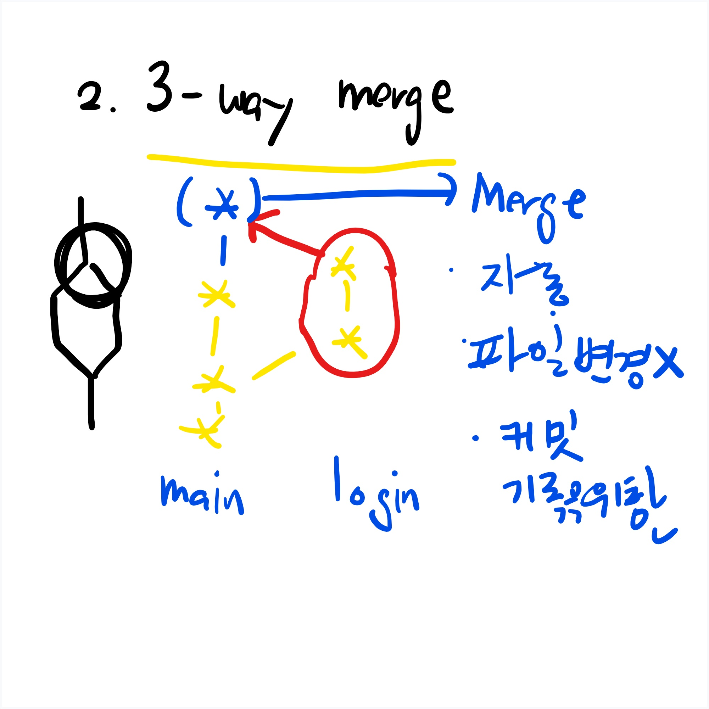

# 08. Merge Branch


-  병합 
  - `git merge {브랜치 이름}`

1. Fast-Forward(잘 일어나지 않는 경우- 브랜치를 해서 작업을 했는데 정작 main에서는 아무런 작업을 하지 안아 바로 merge하는 경우)

   ``` 
   (main)$ git swich -c login
   (login) $ touch login.txt
   (login)$ git add , git commit
   (login)$ git switch main
   (main)$ git merge login
   
   $ git log --oneline --graph --all
   * 456a8f0 (HEAD -> main, login) login 추가
   * 698f27e b추가
   * 5b0480e a추가
   ```

   

2. 3-Way Merge( 일반적인 메인 작업 브랜치 작업 따로하고 합칠경우-충돌이 안나는경우 )

   

   

3. Merge Comflict(메인과 브랜치가 같은 파일을건드려 충돌이 발생할 경우- 자동으로 합쳐지지 않기 때문에 합의해야 한다)

   
   
   ~~~bash
   SEONGSOO@DESKTOP-UBGP9RN MINGW64 ~/git-merge (main)
   $ git merge signup
   CONFLICT (add/add): Merge conflict in README.md
   Auto-merging README.md
   Automatic merge failed; fix conflicts and then commit the result.
   
   SEONGSOO@DESKTOP-UBGP9RN MINGW64 ~/git-merge (main|MERGING)
$
   ~~~
   
   ~~~bash
   SEONGSOO@DESKTOP-UBGP9RN MINGW64 ~/git-merge (main|MERGING) #머지 작업중 
   $ git status
   On branch main
   You have unmerged paths.
     (fix conflicts and run "git commit")
     (use "git merge --abort" to abort the merge)
   
   Unmerged paths:
     (use "git add <file>..." to mark resolution)
           both added:      README.md
   
   no changes added to commit (use "git add" and/or "git commit -a")
   
   SEONGSOO@DESKTOP-UBGP9RN MINGW64 ~/git-merge (main|MERGING)
$
   ~~~
   
   ~~~bash
   campusseven04@DESKTOP-KTJ1O7B MINGW64 ~/git-merge (main|MERGING)
   $ git commit -m '합의함!'
   [main a202512] 합의함!
   
   campusseven04@DESKTOP-KTJ1O7B MINGW64 ~/git-merge (main)
   $
   ~~~
   
   